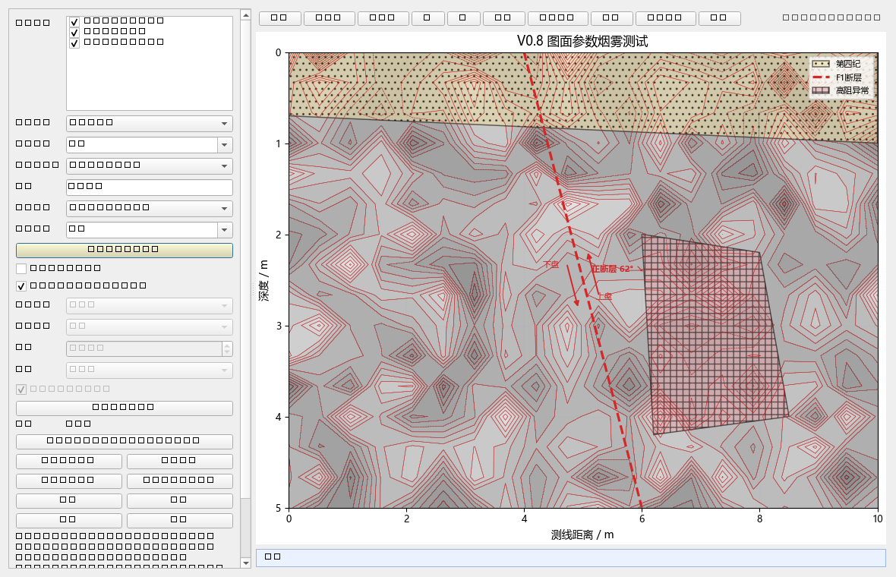
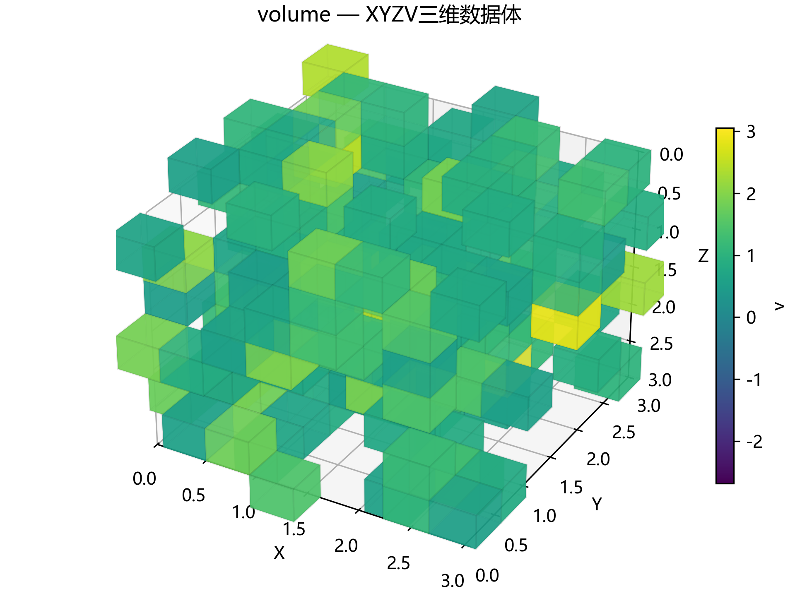
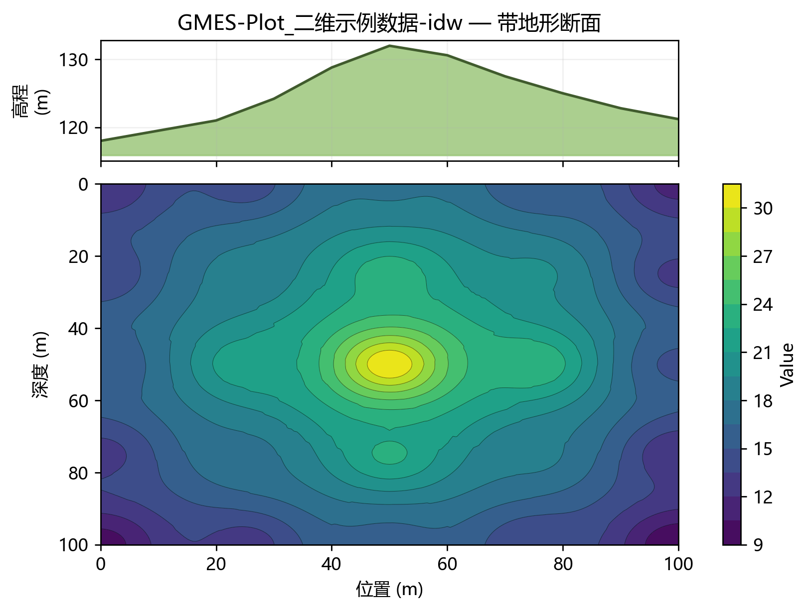
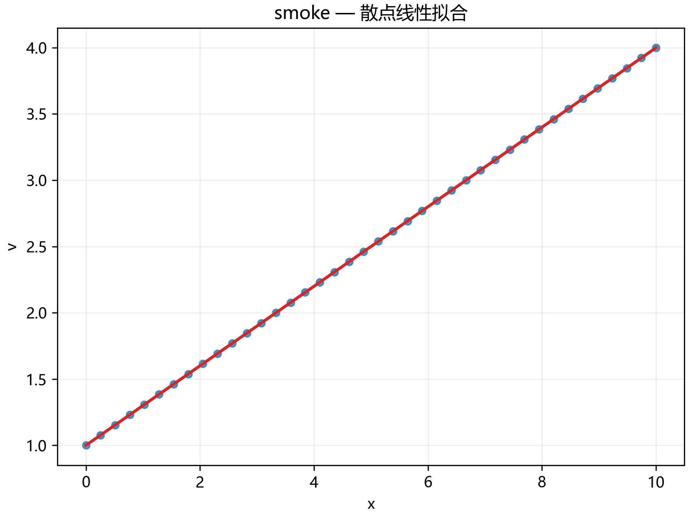

<div align="center">
  
  <h1>GMES-Plot · 重磁电震绘图 Pro</h1>
  <p>面向重力、磁法、电法与地震数据的离线科学绘图、网格化插值和解释辅助桌面软件</p>
</div>

> 当前版本：`v1.2.0` 研究型桌面原型。项目用于展示地球物理数据处理、科学可视化与科研软件工程实践，不替代商业软件或正式生产解释流程。

## 项目定位

GMES-Plot尝试把“原始数据—质量检查—网格化—可视化—解释—导出—复现”组织为一条可追踪的科研工作流。软件默认离线运行，原始数据只读，任何插值、筛选和解释结果均作为派生对象保存。

核心设计目标：

- 支持重力、磁法、电法、地震及一般科学数据的统一绘图入口；
- 兼顾二维等值线、带地形剖面、三维数据体、任意剖面和统计图；
- 保留数据来源、字段映射、插值参数、阈值、颜色方案与相机状态；
- 小数据实时预览，大计算异步执行，并提供抽稀、缓存和取消机制；
- 面向科研图片导出和结果复核，而不仅是生成一张静态图。

## 已实现能力

### 数据与工程

- DAT、TXT、CSV自动解析、预览和XYZV字段映射；
- 散点、规则网格、测线、时间序列和分类数据管理；
- 原始数据只读、派生数据分层保存；
- `.gpproj`工程保存与恢复；
- 工程树中的数据绑定、编辑、安全移除与孤立结果提示。

### 二维与地形

- 线性、最近邻、IDW、RBF及可选普通克里金插值；
- 等值线、填色等值线、热力图、原始散点和插值节点叠加；
- X/Y/Value显示阈值、空间裁剪与可见数量反馈；
- 独立地形数据导入，以及随地形起伏的二维物探断面；
- 地层、岩体、断层、异常区、矩形、椭圆和自由多边形解释工具。

### 三维与剖面

- XYZV散点三维网格化和内存预算；
- 三维曲面、实心体素数据体、切片与等值面；
- X/Y/Z正交剖面和任意三点或法向量定义的倾斜剖面；
- 拖动时低精度、停止后高精度的渐进式交互思路；
- PyVista/VTK可用时启用GPU三维视图，否则安全回退至CPU视图。

### 统计与科研复现

- 折线、柱状、直方、散点拟合、箱线、饼图、玫瑰图和极坐标图；
- 线性、多项式、指数和幂函数拟合；
- 克里金质量评价、交叉验证与误差指标；
- “图—数据—参数”溯源信息；
- PNG、PDF、SVG等科研图片导出。

## 界面预览

| 地质解释 | 三维数据体 |
| --- | --- |
|  |  |

| 带地形断面 | 统计拟合 |
| --- | --- |
|  |  |

## 安装与运行

要求Python 3.10及以上版本。

```powershell
python -m venv .venv
.venv\Scripts\python -m pip install -U pip
.venv\Scripts\python -m pip install -e ".[geostat]"
.venv\Scripts\python -m gmes_plot
```

如需PyVista/VTK三维加速：

```powershell
.venv\Scripts\python -m pip install -e ".[geostat,volume]"
```

在Windows中也可双击：

- `run_gmes_plot.cmd`：正常启动；
- `run_gmes_plot_debug.cmd`：保留错误窗口，便于诊断。

## 快速体验

`examples/data`提供合成示例数据：

- `GMES-Plot_二维示例数据.csv`
- `GMES-Plot_三维示例数据.csv`
- `GMES-Plot_地形示例数据.txt`

推荐流程：导入数据 → 检查字段映射 → 创建二维/三维网格 → 绘图 → 调整阈值与样式 → 导出图片或保存工程。

## 测试

```powershell
.venv\Scripts\python -m pip install -e ".[geostat,dev]"
.venv\Scripts\python -m pytest
```

测试覆盖数据导入、工程读写、网格化、阈值建议、地形、三维切片、科研溯源和主要界面状态。

## 代码结构

```text
src/gmes_plot/
├─ domain/       # 数据集、图层、页面和工程模型
├─ services/     # 导入、网格化、阈值、切片和科研分析
├─ ui/           # 主窗口、对话框与二维/三维/统计画布
└─ assets/       # 软件图标与界面资源
tests/           # 自动化测试
examples/data/   # 合成示例数据
docs/images/     # 功能预览图
```

## 当前边界与路线

当前版本仍属于模块化科研原型。完整期刊模板库、自动异常边界提取、Surfer/Origin工程迁移、插件SDK和脚本接口仍在后续规划中。三维大数据性能受硬件、VTK/PyVista环境和体素规模影响。

## 数据与许可

- 软件默认离线运行，不上传用户数据；
- 仓库中的示例数据均为合成数据；
- 当前未授予开源许可证，使用与版权说明见 [RIGHTS.md](RIGHTS.md)。


